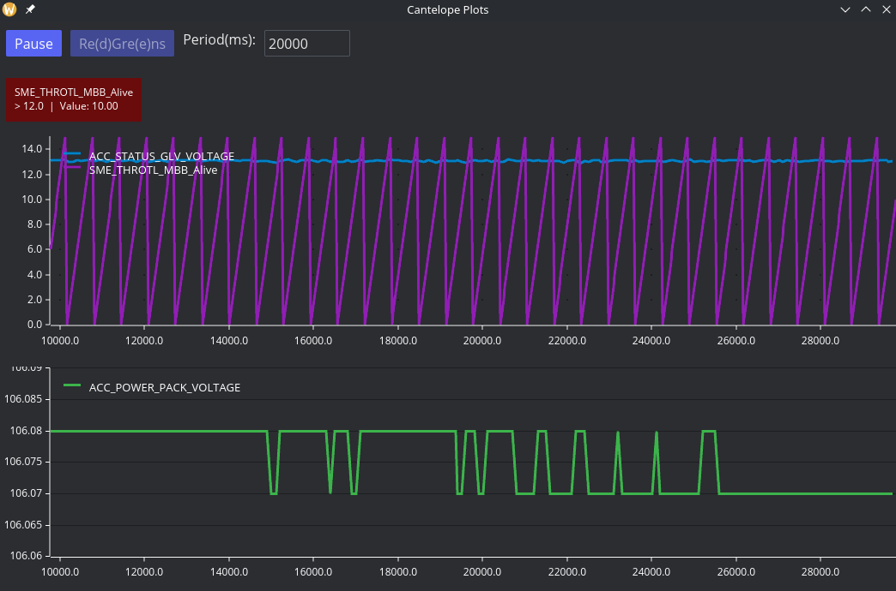

# Cantelope
Existing tools like Busmaster, Can++, and SavvyCan emphasize debugging and reverse engineering CAN busses. This is a reasonably effecient, simple to use tool for handling CAN data in conjunction with alredy working DBC files which is focussed on the data, not the bus itself.

Cantelope uses arrow internally and primarily outputs `.parquet` files, which are effecient for data typically transmitted over CAN and are easily handled by data science tools like python pandas/polars as well as database engines like duckdb.

This is a rust project built with arrow-rs, iced-rs, dbc-rs, and various other libraries.



## Usage
Example:
```
./cantelope --dbc fs.dbc --candump realdata.log --cache-ms 10 --output testi.parquet
```
You can also use `--stdin` or  `--socket` instead of `--candump`.

If you don't pass `--output`, cantelope won't store values. This is useful for using the live plotting function. Memory usage should be <100mb under this circumstance.

`--stdin` and `--candump` expect line seperated frames in the following format `(time in seconds) interface id_in_hex#data_in_hex` Ex:
```
(1759876075.171400) can0 288#8A2C642B00000000
```
You can produce these with `candump -ta -n 0 can0` for stdout output or `candump -L` for log file output.

Ommiting file arguments will usually cause a gui file selection prompt. See below.

## Remote mode
You can add `--remote ip:port` and to connect to a TCP server.

Conveniently available is the sender binary which transmits packets in the appropriate format. Ex:
```
./sender vcan0 2129"
```

## Full arguments list
- `--dbc | -d` specifies the dbc file to use for parsing, if not provided, cantelope will try to call system gui for file selection. Behavior on systems without gui unknown.
- Input Argument
  - If no input argument is provided, cantelope will default to candump mode and try to call system gui for file selection.
  -  `--candump | -f` tells cantelope to use a file for input. File must be specified.
  - `--socket | -s` tells cantelope to use a (specified) socketcan interface for input. If `--features socket` was not built, cantelope will panic.
  - `--stdin | -t` tells cantelope to use stdin in the same format as `--candump`
  - `--tcp` tells cantelope to establish a tcp connection at specififed `ip:port`. Intended for use with sender and relay binaries.
  - `--udp` is not currently implemented. Behavior unknown.
- `--output | -o` tells cantelope to store data and ultimately output a parquet file with the specified name. Data is limited to memory size for now.
  - `--cache_ms | -c` will set the minimum time interval of rows outputted to parquet. Highly recommended.
- GUI
  - Each `--plot | -p` argument will enable and add a plot to the plotting window. Specify which signals to put on the plot by comma (but not space) seperating their names.
  - A `--regrens | -rg` argument (only provide one!) will add each comma seperated inequality to the regrens row. The "true" state of the inequality is mapped to green.
- `--emit-config` tells cantelope to output a `.toml` with the arguments you've provided. If you provide a file name, it will use it. If you do not provide a file name, cantelope will try to call system gui for file selection. You can load a config file instead of passing arguments by passing exactly zero arguments, in which case cantelope will call the system gui to select a file.

## Build notes
- If you're on linux, build with `--features socket` so you can use SocketCan interfaces.
- If you wanna cross compile for windows, use cross.
